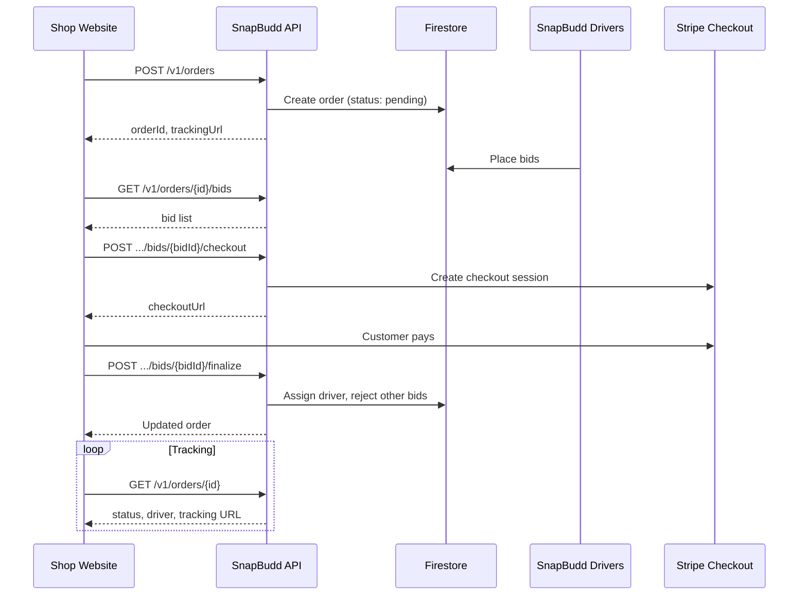

# SnapBudd Merchant API — Developer Guide

This guide is for developers integrating SnapBudd delivery into a shop website.

## Prerequisites

1. **Merchant account** — Register at the SnapBudd Merchant Portal
2. **Admin approval** — Your business profile must be approved
3. **API credentials** — Generate from Merchant Portal → **API access**
4. **Backend integration** — Call the API from your server, not browser JavaScript

## Base URL

| Environment | URL |
|-------------|-----|
| Local | `http://localhost:3000` |
| Production | Set by your deployment (e.g. `https://api.snapbudd.io`) |

## Authentication headers

Every order API request must include:

```http
X-Merchant-Id: <your_merchant_id>
X-Api-Key: sb_live_<secret>
Content-Type: application/json
```

## Integration flow



## 1. Create order

**`POST /v1/orders`**

### Required fields

| Field | Type | Rules |
|-------|------|-------|
| `pickup.formatted` | string | Full pickup address |
| `pickup.city` | string | City name (must be in service area) |
| `pickup.countryCode` | string | ISO 2-letter code (e.g. `NO`) |
| `dropoff.formatted` | string | Full dropoff address |
| `dropoff.city` | string | City name |
| `dropoff.countryCode` | string | ISO 2-letter code |
| `pickupContact.name` | string | Max 120 chars |
| `pickupContact.phone` | string | Max 40 chars |
| `dropoffContact.name` | string | Max 120 chars |
| `dropoffContact.phone` | string | Max 40 chars |
| `itemDescription` | string | Min 5, max 500 chars |
| `receiptUrl` | string | HTTPS URL to order receipt |

### Optional fields

| Field | Type | Default |
|-------|------|---------|
| `customer.name` | string | `""` |
| `customer.phone` | string | `""` |
| `packageSize` | `Small` \| `Medium` \| `Large` | `Medium` |
| `packageType` | `General` \| `Documents` \| `Food` \| `Fragile` | `General` |
| `vehicleType` | `Car` \| `Van` | `Car` |
| `fragile` | boolean | `false` |
| `requiresSignature` | boolean | `false` |
| `contactless` | boolean | `false` |
| `returnToShop` | boolean | `false` |
| `notes` | string | `""` |
| `amount` | number | Auto-calculated total (NOK) |
| `scheduledAt` | string | ISO-8601 datetime |
| `pickup.lat`, `pickup.lng` | number | Geocoded from address |
| `dropoff.lat`, `dropoff.lng` | number | Geocoded from address |

### Example request

```bash
curl -X POST https://api.snapbudd.io/v1/orders \
  -H "X-Merchant-Id: YOUR_MERCHANT_ID" \
  -H "X-Api-Key: sb_live_YOUR_KEY" \
  -H "Content-Type: application/json" \
  -d '{
    "pickup": {
      "formatted": "Karl Johans gate 1, 0154 Oslo",
      "city": "Oslo",
      "countryCode": "NO",
      "lat": 59.9139,
      "lng": 10.7522
    },
    "dropoff": {
      "formatted": "Aker Brygge 10, 0250 Oslo",
      "city": "Oslo",
      "countryCode": "NO"
    },
    "pickupContact": { "name": "Shop Desk", "phone": "+4712345678" },
    "dropoffContact": { "name": "Ola Nordmann", "phone": "+4798765432" },
    "itemDescription": "Blue winter jacket size M",
    "receiptUrl": "https://your-shop.com/receipts/order-123.pdf"
  }'
```

### Example response (`201`)

```json
{
  "orderId": "abc123xyz",
  "status": "pending",
  "trackingToken": "abc123xyz",
  "trackingUrl": "https://snapbudd.io/merchant/track?merchantId=...&orderId=...&token=...",
  "pricing": {
    "currency": "NOK",
    "total": 378.0,
    "distanceKm": 2.4,
    "durationMin": 8
  }
}
```

## 2. List bids

**`GET /v1/orders/{orderId}/bids`**

Returns active driver bids sorted by creation time.

```json
[
  {
    "bidId": "driver_uid",
    "status": "active",
    "offer": { "amount": 350, "currency": "NOK", "etaMin": 25 },
    "driver": { "id": "...", "name": "...", "ratingAvg": 4.8 },
    "vehicle": { "type": "Car", "plate": "AB12345" }
  }
]
```

## 3. Accept bid (checkout)

**`POST /v1/orders/{orderId}/bids/{bidId}/checkout`**

```json
{ "returnUrl": "https://your-shop.com/orders/complete" }
```

Response:

```json
{
  "checkoutUrl": "https://checkout.stripe.com/...",
  "sessionId": "cs_test_...",
  "orderId": "...",
  "bidId": "..."
}
```

Redirect your customer (or open in new tab) to `checkoutUrl`.

## 4. Finalize bid acceptance

After Stripe redirects back with `session_id`:

**`POST /v1/orders/{orderId}/bids/{bidId}/finalize`**

```json
{ "sessionId": "cs_test_..." }
```

This assigns the driver and rejects other bids.

## 5. Track order

**`GET /v1/orders/{orderId}`**

Returns status, assignment, pricing, timeline, and public tracking URL.

### Order statuses

| Status | Meaning |
|--------|---------|
| `pending` | Open for driver bids |
| `bidding` | Customer order variant of open |
| `bid_accepted` | Driver assigned after payment |
| `pickup_started` | Driver en route to pickup |
| `arrived` | At pickup or dropoff |
| `picked_up` | Package collected |
| `in_transit` | En route to dropoff |
| `delivered` | Awaiting PIN confirmation |
| `completed` | Delivery finished |
| `cancelled` | Cancelled |

## Error format

```json
{
  "success": false,
  "error": {
    "code": "VALIDATION_ERROR",
    "message": "Validation failed",
    "details": ["itemDescription must be longer than or equal to 5 characters"]
  }
}
```

## Security notes

- Store `X-Api-Key` in server environment variables only
- Regenerate the key if it is ever exposed
- Validate order data on your side before calling the API
- Use HTTPS for all requests
- Upload receipts to your own storage and pass a public HTTPS `receiptUrl`

## Public tracking page

Share the `trackingUrl` from create/track responses with end customers. It opens the SnapBudd merchant public tracking page without requiring login.

## Support

- Merchant Portal → **API guide** for live examples with your Merchant ID
- Merchant Portal → **Tracking** for active deliveries
